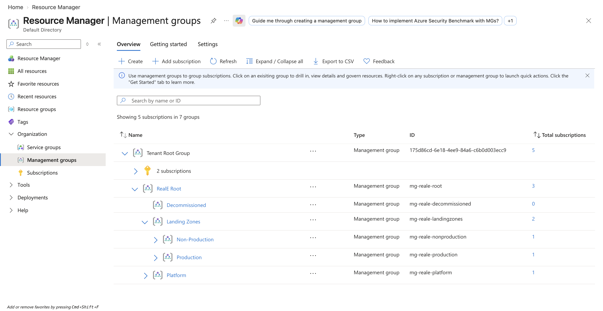
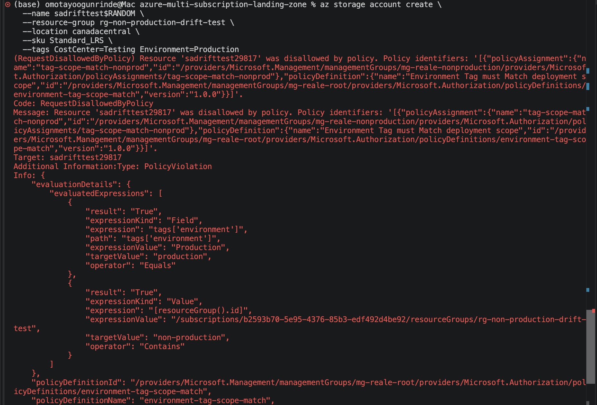
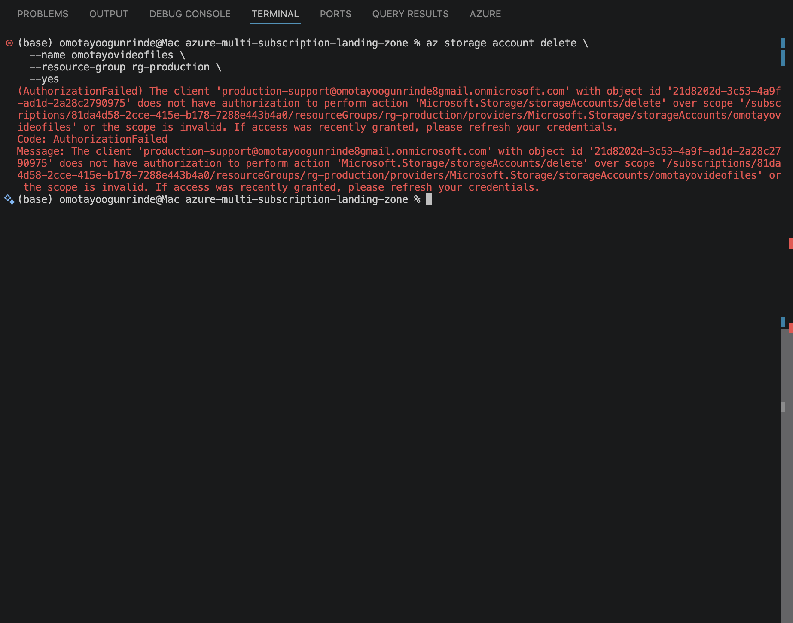
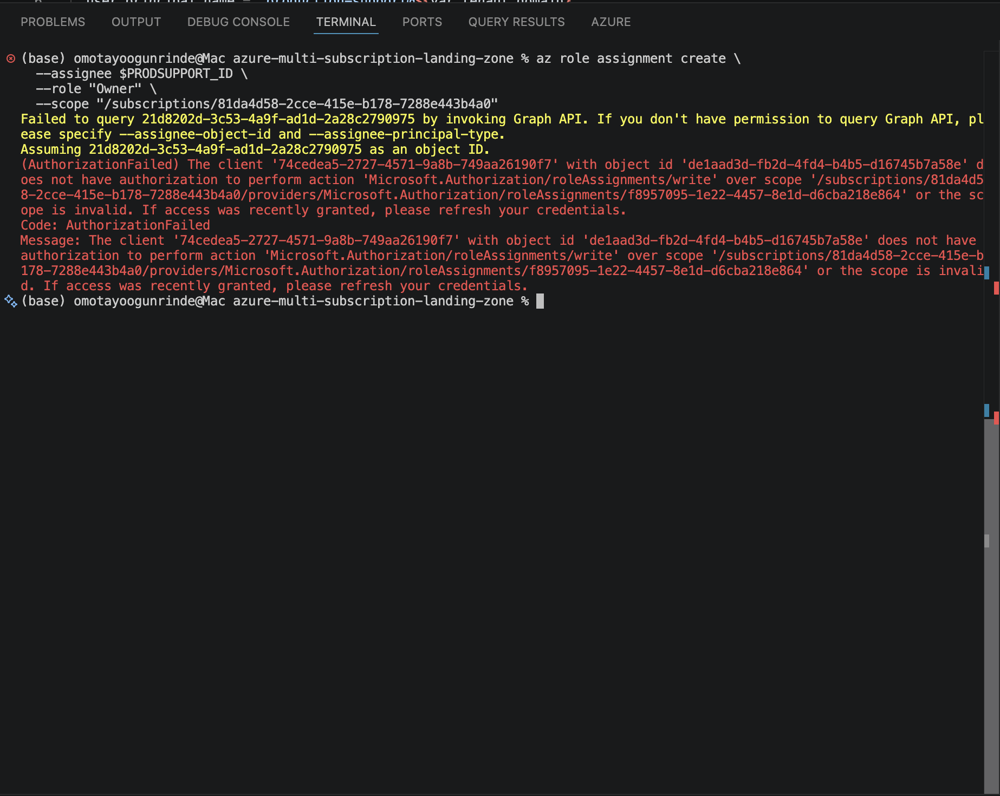
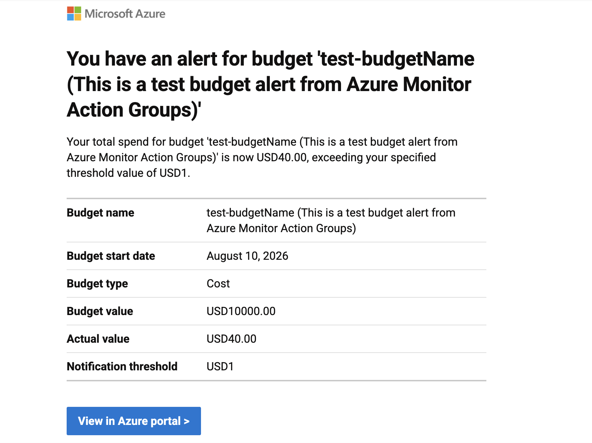
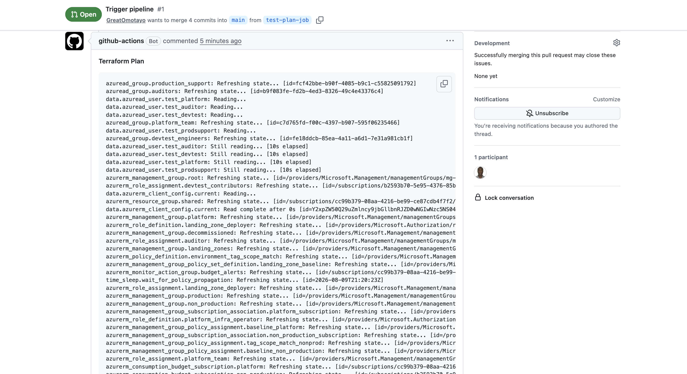
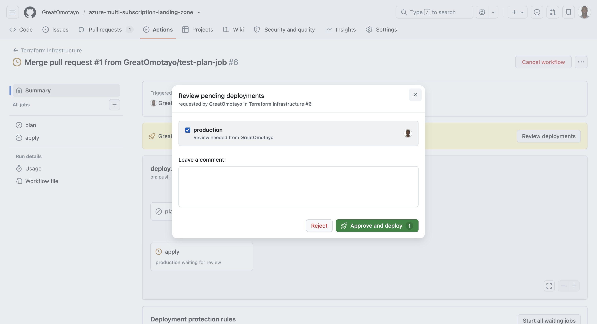

# Multi-Subscription Azure Landing Zone with Governance & Cost Controls

A Terraform-managed Azure Landing Zone spanning 3 subscriptions under a single Entra ID tenant, implementing Management Group hierarchy, policy-as-code guardrails, least-privilege RBAC, and subscription-level cost controls — deployed via an OIDC-authenticated GitHub Actions pipeline with a human-approval gate before production changes.

This project demonstrates the enterprise landing zone pattern (aligned with Microsoft's Cloud Adoption Framework) at a scale appropriate for a portfolio build: 3 subscriptions, one tenant, full governance and identity design.

---

## Architecture

```
Tenant Root Group
└── mg-reale-root
    ├── mg-platform            → Platform subscription (shared services)
    ├── mg-landingzones
    │   ├── mg-production      → Production subscription
    │   └── mg-nonprod         → NonProd subscription
    └── mg-decommissioned      (reserved, empty)
```

**Platform** — shared services subscription: state storage, budget Action Group, future shared networking/DNS/Key Vault.
**Production** — customer-facing workloads. Strictest policy enforcement.
**NonProd** — development/test workloads. Relaxed policy enforcement for velocity.

---

## What this project builds

| Layer | What it does |
|---|---|
| **Management Groups** | Hierarchical structure so policy and RBAC inherit down to subscriptions automatically, including to any subscription added later |
| **Azure Policy** | A custom Initiative bundling built-in policies (allowed locations, required tags, deny public IP, allowed VM SKUs, storage encryption) with per-environment effect tuning (Deny in Production, Audit in NonProd) — plus one hand-authored custom policy for tag/scope drift detection |
| **RBAC** | Custom roles (`Platform Infrastructure Operator`, `Production Support Operator`, `Landing Zone Deployer`) where built-ins were too broad, assigned at Management Group scope for automatic inheritance; 4 Entra ID security groups managed as code |
| **Cost Controls** | Per-subscription budgets with tiered alert thresholds (80%/100% in Production, 80% only in Platform/NonProd), routed through a dedicated Action Group |
| **CI/CD** | OIDC-authenticated GitHub Actions pipeline — `plan` on PR, `apply` on merge to `main`, gated behind a GitHub Environment requiring manual approval before any change reaches the tenant |

---

## Repository structure

```
azure-landing-zone/
├── providers.tf                        # azurerm (3 subscription aliases) + azuread
├── backend.tf                          # remote state config (static values)
├── backend.hcl                         # remote state secrets (gitignored)
├── variables.tf
├── terraform.tfvars.example
├── management-groups.tf                # Phase 1
├── subscription-associations.tf        # Phase 1
├── policy-initiative.tf                # Phase 2
├── policy-assignments.tf               # Phase 2
├── custom-policy-tag-scope-match.tf    # Phase 2
├── custom-roles.tf                     # Phase 3
├── entra-groups.tf                     # Phase 3
├── role-assignments.tf                 # Phase 3
├── test-users.tf                       # RBAC validation — data lookups + group membership only, users created manually
├── budgets.tf                          # Phase 4
├── outputs.tf
├── .github/workflows/deploy.yml        # Phase 6
├── diagrams/architecture.png
├── README.md
└── DECISIONS.md
```

---

## Prerequisites

- 3 Azure subscriptions under one Entra ID tenant, mapped to Platform / Production / NonProd roles
- An app registration (`multi-subscription-landing-zone`) with federated credentials for `pull_request` and `environment:production` GitHub Actions subjects
- Microsoft Graph `Group.ReadWrite.All` application permission, admin-consented, on that app registration
- A pre-existing storage account for Terraform remote state (in the Platform subscription)
- Azure CLI authenticated as a user with Owner/User Access Administrator rights, for the one-time bootstrap

---

## Configuration

Copy `terraform.tfvars.example` to `terraform.tfvars` (gitignored) and fill in:

```hcl
platform_subscription_id         = ""   # Platform subscription GUID
production_subscription_id       = ""   # Production subscription GUID
non_production_subscription_id   = ""   # NonProd subscription GUID
alert_email_address              = ""   # Where budget alerts are sent
shared_resource_group_name       = ""   # e.g. rg-platform-shared
oidc_service_principal_object_id = ""   # Object ID of the multi-subscription-landing-zone service principal — see Prerequisites
tenant_domain                    = ""   # e.g. yourtenant.onmicrosoft.com — used for test user data lookups
budget_amount                    = 2    # Deliberately low during validation; raise before production use — see DECISIONS.md
```

For the pipeline, the same values are supplied via `TF_VAR_*` environment variables sourced from GitHub Secrets (sensitive/account-specific values) and GitHub Variables (`SHARED_RG_NAME`, `BUDGET_AMOUNT` — non-secret configuration) — see `DECISIONS.md` → "Terraform variables injected via TF_VAR_* environment variables" for the full mapping and reasoning.

---

## Deployment sequence

This project uses a **manual bootstrap, pipeline-governed thereafter** model — see `DECISIONS.md` → "Bootstrapping the Deployer Identity" for the full reasoning.

1. Provision state storage in the Platform subscription (resource group + storage account + container)
2. Create the `multi-subscription-landing-zone` app registration and service principal; add federated credentials (`pull_request`, `environment:production`) and grant Graph API permission (`Group.ReadWrite.All`, admin-consented) — needed for the pipeline's future runs
3. Confirm the project owner's own account already holds Owner on all 3 subscriptions and a directory role (Global Administrator) covering Entra ID group creation
4. Run `terraform init` / `plan` / `apply` **manually, as the project owner** — this single run creates the Management Groups, custom Policy initiative, custom RBAC roles, Entra ID groups, role assignments (including granting `Landing Zone Deployer` to the service principal), and budgets
5. No cleanup step is needed — the service principal never holds any role beyond its final least-privilege `Landing Zone Deployer` assignment, since it was never authenticated during the bootstrap `apply` in the first place
6. All subsequent changes flow through the GitHub Actions pipeline only: PR → automated `plan` comment → merge → manual approval → `apply`

---

## Policy enforcement summary

| Guardrail | Platform | Production | NonProd |
|---|---|---|---|
| Require resource tags | **Deny** | **Deny** | **Deny** |
| Allowed regions | **Deny** | **Deny** | **Deny** |
| Allowed VM SKUs | **Deny** | **Deny** | **Deny** |
| Storage encryption (CMK) | Audit | Audit | Audit |
| Tag/scope drift (custom) | — | — | **Deny** |

Effects are deliberately differentiated per environment rather than uniformly `Deny` — see `DECISIONS.md` for the reasoning.

---

## RBAC summary

| Persona | Role | Scope | Built-in or custom |
|---|---|---|---|
| Platform team | Platform Infrastructure Operator | `mg-platform` | Custom |
| Production support | Production Support Operator | `mg-production` | Custom |
| Dev/Test engineers | Contributor | NonProd subscription | Built-in (deliberate exception) |
| Auditors | Reader | `mg-reale-root` | Built-in |
| CI/CD pipeline identity | Landing Zone Deployer | `mg-reale-root` | Custom — explicitly excludes `Microsoft.Authorization/*` write actions |

---

## Testing & validation

Each guardrail below was deliberately triggered to confirm it behaves as designed — not just deployed and assumed to work. Screenshots captured from the Azure Portal / CLI as proof.

### 1. Management Group hierarchy exists as designed

Confirms the full `mg-reale-root` → Platform / Landing Zones (Production, NonProd) / Decommissioned structure is live, with all 3 subscriptions correctly associated.



### 2. Policy denial — public IP blocked in Production

Attempted to deploy a public IP address resource in the Production subscription. Expected: denied, since Production's `publicIpEffect` parameter is set to `Deny`.


### 3. Policy audit (not blocked) — same action in NonProd

Same public IP deployment attempted in NonProd. Expected: allowed, but flagged as non-compliant in Policy compliance view, since NonProd uses `Audit` for this guardrail rather than `Deny`.


### 4. Policy denial — missing required tag

Attempted a resource deployment without the required tag, in any environment. Expected: denied everywhere, since tag enforcement is `Deny` across all 3 management groups.


### 5. Custom policy — tag/scope drift caught

Attempted to deploy a resource tagged `Environment=Production` inside a NonProd-scoped resource group. Expected: denied by the custom `environment-tag-must-match-scope` policy.



### 6. RBAC boundary — Production Support Operator cannot delete resources

Signed in as a member of the `Production-Support` group and attempted to delete a resource in Production. Expected: denied, since the custom role explicitly excludes delete actions.



### 7. RBAC boundary — Landing Zone Deployer cannot modify role assignments

Attempted a role assignment change using the pipeline's service principal credentials directly. Expected: denied, since `Landing Zone Deployer` explicitly excludes `Microsoft.Authorization/*` write actions.



### 8. Budget alert fired

Confirms the Action Group and email notification path work end-to-end — either a real threshold breach or a manually-triggered test alert.



### 9. CI/CD pipeline — plan posted to PR, apply gated on approval

Shows the automated `plan` output as a PR comment, and the `production` environment's required-reviewer prompt blocking `apply` until manually approved.




---

## Related projects

- [`azure-terraform-cicd-pipeline`](https://github.com/GreatOmotayo/azure-terraform-cicd-pipeline) — OIDC pipeline pattern reused in this project
- [`azure-cost-governance-and-waste-detection`](https://github.com/GreatOmotayo/azure-cost-governance-and-waste-detection) — subscription-wide cost tooling; deliberately **not** cross-referenced by this project's budget alerts, to keep each project independently deployable (see `DECISIONS.md`)

---

## Author

Omotayo — backend engineer transitioning into Cloud/Platform Engineering. Built as part of a portfolio series demonstrating enterprise Azure governance patterns.
